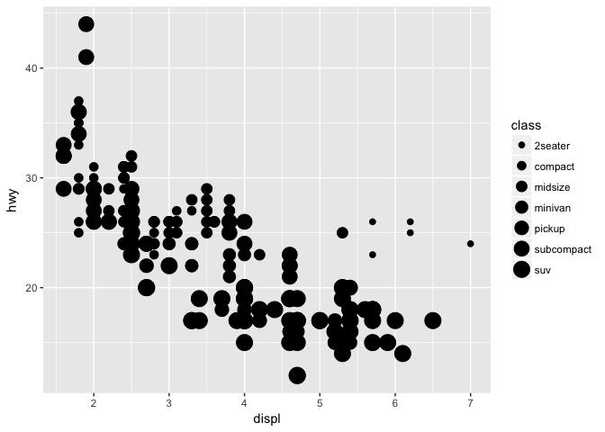
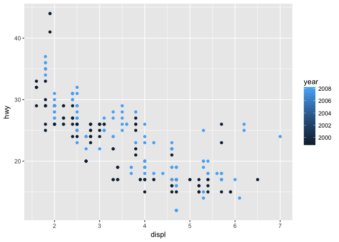
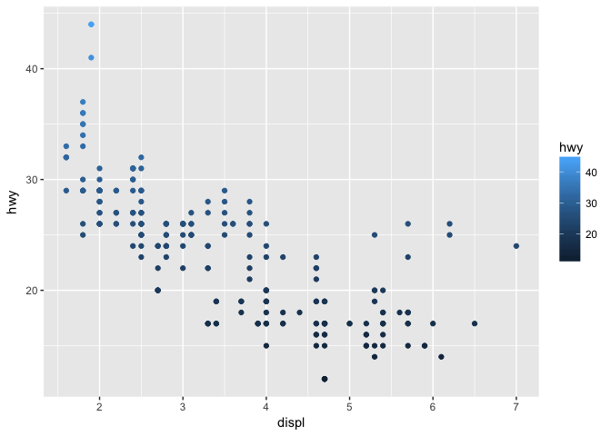
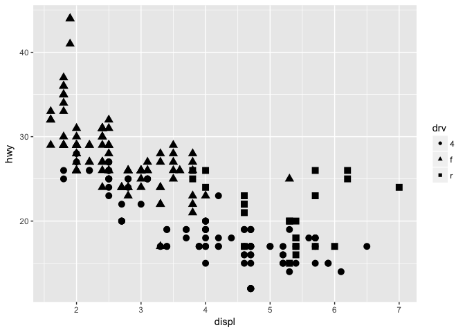
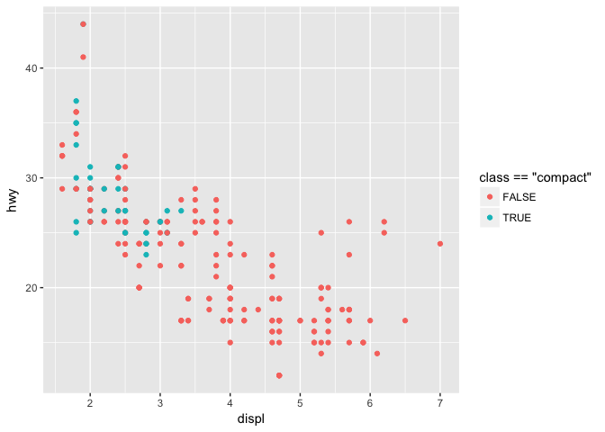
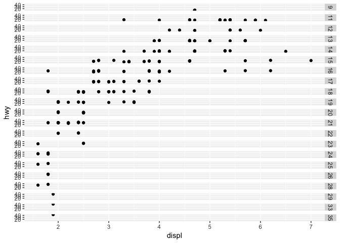
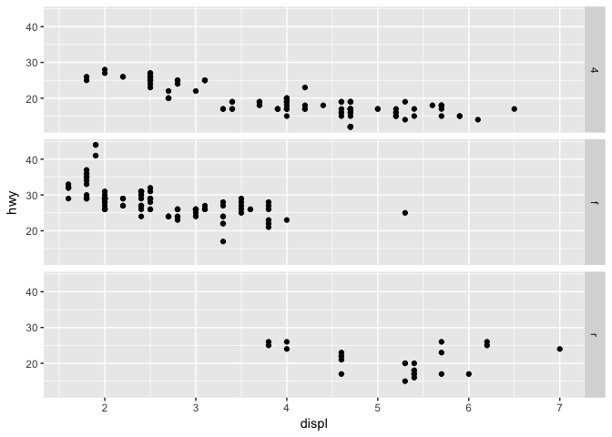
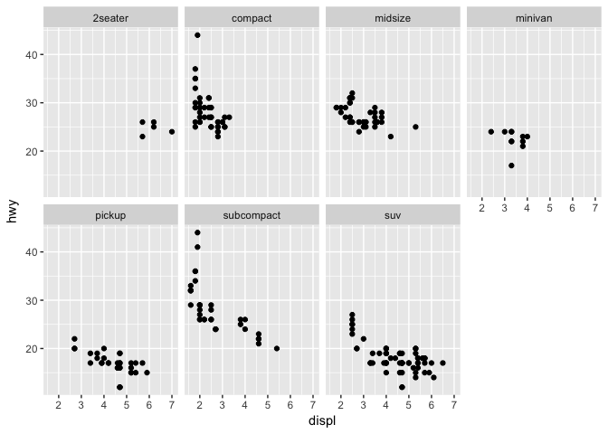

# Rmarkdown_HW_Apr26
Rongkui Han  
April 25, 2017  
####3.1.1 Prerequisites  

```r
library(tidyverse)
```

```
## Loading tidyverse: ggplot2
## Loading tidyverse: tibble
## Loading tidyverse: tidyr
## Loading tidyverse: readr
## Loading tidyverse: purrr
## Loading tidyverse: dplyr
```

```
## Conflicts with tidy packages ----------------------------------------------
```

```
## filter(): dplyr, stats
## lag():    dplyr, stats
```
####3.2 First Steps  

```r
ggplot2::mpg
```

```
## # A tibble: 234 × 11
##    manufacturer      model displ  year   cyl      trans   drv   cty   hwy
##           <chr>      <chr> <dbl> <int> <int>      <chr> <chr> <int> <int>
## 1          audi         a4   1.8  1999     4   auto(l5)     f    18    29
## 2          audi         a4   1.8  1999     4 manual(m5)     f    21    29
## 3          audi         a4   2.0  2008     4 manual(m6)     f    20    31
## 4          audi         a4   2.0  2008     4   auto(av)     f    21    30
## 5          audi         a4   2.8  1999     6   auto(l5)     f    16    26
## 6          audi         a4   2.8  1999     6 manual(m5)     f    18    26
## 7          audi         a4   3.1  2008     6   auto(av)     f    18    27
## 8          audi a4 quattro   1.8  1999     4 manual(m5)     4    18    26
## 9          audi a4 quattro   1.8  1999     4   auto(l5)     4    16    25
## 10         audi a4 quattro   2.0  2008     4 manual(m6)     4    20    28
## # ... with 224 more rows, and 2 more variables: fl <chr>, class <chr>
```

```r
ggplot(data = mpg) + 
  geom_point(mapping = aes(x = displ, y = hwy))
```

<!-- -->

####3.2.4 Exercises  
#####3.2.4.1   

```r
ggplot(data = mpg)
```

<!-- -->
I see an empty space  

#####3.2.4.2   

```r
mtcars
```

```
##                      mpg cyl  disp  hp drat    wt  qsec vs am gear carb
## Mazda RX4           21.0   6 160.0 110 3.90 2.620 16.46  0  1    4    4
## Mazda RX4 Wag       21.0   6 160.0 110 3.90 2.875 17.02  0  1    4    4
## Datsun 710          22.8   4 108.0  93 3.85 2.320 18.61  1  1    4    1
## Hornet 4 Drive      21.4   6 258.0 110 3.08 3.215 19.44  1  0    3    1
## Hornet Sportabout   18.7   8 360.0 175 3.15 3.440 17.02  0  0    3    2
## Valiant             18.1   6 225.0 105 2.76 3.460 20.22  1  0    3    1
## Duster 360          14.3   8 360.0 245 3.21 3.570 15.84  0  0    3    4
## Merc 240D           24.4   4 146.7  62 3.69 3.190 20.00  1  0    4    2
## Merc 230            22.8   4 140.8  95 3.92 3.150 22.90  1  0    4    2
## Merc 280            19.2   6 167.6 123 3.92 3.440 18.30  1  0    4    4
## Merc 280C           17.8   6 167.6 123 3.92 3.440 18.90  1  0    4    4
## Merc 450SE          16.4   8 275.8 180 3.07 4.070 17.40  0  0    3    3
## Merc 450SL          17.3   8 275.8 180 3.07 3.730 17.60  0  0    3    3
## Merc 450SLC         15.2   8 275.8 180 3.07 3.780 18.00  0  0    3    3
## Cadillac Fleetwood  10.4   8 472.0 205 2.93 5.250 17.98  0  0    3    4
## Lincoln Continental 10.4   8 460.0 215 3.00 5.424 17.82  0  0    3    4
## Chrysler Imperial   14.7   8 440.0 230 3.23 5.345 17.42  0  0    3    4
## Fiat 128            32.4   4  78.7  66 4.08 2.200 19.47  1  1    4    1
## Honda Civic         30.4   4  75.7  52 4.93 1.615 18.52  1  1    4    2
## Toyota Corolla      33.9   4  71.1  65 4.22 1.835 19.90  1  1    4    1
## Toyota Corona       21.5   4 120.1  97 3.70 2.465 20.01  1  0    3    1
## Dodge Challenger    15.5   8 318.0 150 2.76 3.520 16.87  0  0    3    2
## AMC Javelin         15.2   8 304.0 150 3.15 3.435 17.30  0  0    3    2
## Camaro Z28          13.3   8 350.0 245 3.73 3.840 15.41  0  0    3    4
## Pontiac Firebird    19.2   8 400.0 175 3.08 3.845 17.05  0  0    3    2
## Fiat X1-9           27.3   4  79.0  66 4.08 1.935 18.90  1  1    4    1
## Porsche 914-2       26.0   4 120.3  91 4.43 2.140 16.70  0  1    5    2
## Lotus Europa        30.4   4  95.1 113 3.77 1.513 16.90  1  1    5    2
## Ford Pantera L      15.8   8 351.0 264 4.22 3.170 14.50  0  1    5    4
## Ferrari Dino        19.7   6 145.0 175 3.62 2.770 15.50  0  1    5    6
## Maserati Bora       15.0   8 301.0 335 3.54 3.570 14.60  0  1    5    8
## Volvo 142E          21.4   4 121.0 109 4.11 2.780 18.60  1  1    4    2
```
mtcars has 32 rows and 11 columns.  

#####3.2.4.3   

```r
?mpg
```
drv indicates what kind of "drive" a motor vehicle is. It can be a front-wheel drive (f), a rear wheel drive ("r"), or a four wheel drive ("4").  

#####3.2.4.4   

```r
ggplot(data = mpg) +
  geom_point(mapping = aes(x = hwy, y = cyl))
```

<!-- -->

#####3.2.4.5   

```r
ggplot(data = mpg) +
  geom_point(mapping = aes(x = class, y = drv))
```

<!-- -->
The class vs drv plot is not informative because a lot of dots overlapped on top of each other, resulting in great loss of information.  

####3.3 Aesthetic Mappings   

```r
ggplot(data = mpg) + 
  geom_point(mapping = aes(x = displ, y = hwy, color = class))
```

<!-- -->

```r
ggplot(data = mpg) + 
  geom_point(mapping = aes(x = displ, y = hwy, size = class))
```

```
## Warning: Using size for a discrete variable is not advised.
```

<!-- -->

```r
## It is generally not advicable to use an ordered aesthetics (e.g. size) for an unordered variable (e.g. class)
ggplot(data = mpg) + 
  geom_point(mapping = aes(x = displ, y = hwy, alpha = class))
```

<!-- -->

```r
ggplot(data = mpg) + 
  geom_point(mapping = aes(x = displ, y = hwy, shape = class))
```

```
## Warning: The shape palette can deal with a maximum of 6 discrete values
## because more than 6 becomes difficult to discriminate; you have 7.
## Consider specifying shapes manually if you must have them.
```

```
## Warning: Removed 62 rows containing missing values (geom_point).
```

<!-- -->

```r
## SUV class disappeared because ggplot can only do 6 shapes at a time. 
ggplot(data = mpg) + 
  geom_point(mapping = aes(x = displ, y = hwy), color = "blue")
```

<!-- -->

```r
## make sure this time the "color = " argument is not in the aes() brackets. Or color will appear as a varieble with a legend the says "blue".)
```

####3.3.1 Exercises  
#####3.3.1.1   
The code   
ggplot(data = mpg) +   
  geom_point(mapping = aes(x = displ, y = hwy, color = "blue"))  
is wrong because the color = argument went inside the aes() bracket.  
 
#####3.3.1.2   
Categorical variables are :"manufacturer", "model", "trans", "drv", "fl" and "class".   
Continuous variables are "displ", "year", "cyl", "cty" and "hwy".      
I can see the class of each variable when I run _ggplot2::mpg_. The class of each variable (character, integer etc.) appears in "<>"'s underneath the name of the variable.  

#####3.3.1.3   

```r
ggplot(data = mpg) + 
  geom_point(mapping = aes(x = displ, y = hwy, color = year))
```

<!-- -->
The color has a gradient (although in this case the gradient only shows in the legend).   

#####3.3.1.4   

```r
ggplot(data = mpg) + 
  geom_point(mapping = aes(x = displ, y = hwy, color = hwy))
```

<!-- -->
The color gradient follows the number increments on the y axis.  

#####3.3.1.5   

```r
?geom_point
ggplot(data = mpg) + 
  geom_point(mapping = aes(x = displ, y = hwy, shape = drv, stroke = 5))
```

<!-- -->

```r
ggplot(data = mpg) + 
  geom_point(mapping = aes(x = displ, y = hwy, shape = drv, stroke = 3))
```

<!-- -->
It looks like stroke designates the size of the dots. It also looks like that it works for the hollow and solid shapes. Not sure about the color-filled ones.   

#####3.3.1.6     

```r
ggplot(data = mpg) + 
  geom_point(mapping = aes(x = displ, y = hwy, color = displ <5))
```

<!-- -->

```r
ggplot(data = mpg) + 
  geom_point(mapping = aes(x = displ, y = hwy, color = class =="compact"))
```

<!-- -->
It colors the data points by the truthfulness of the statement (displ <5 or >= 5).    

####3.5 Facets  

```r
ggplot(data = mpg) + 
  geom_point(mapping = aes(x = displ, y = hwy)) + 
  facet_wrap(~ class, nrow = 2)
```

<!-- -->

```r
ggplot(data = mpg) + 
  geom_point(mapping = aes(x = displ, y = hwy)) + 
  facet_grid(drv ~ cyl)
```

<!-- -->

```r
ggplot(data = mpg) + 
  geom_point(mapping = aes(x = displ, y = hwy)) + 
  facet_grid(. ~ cyl)
```

<!-- -->

```r
##For facetting by only one variable, use facet_wrap(~ <var>) for categorial variables, and facet_grid(. ~ <var>) (or facet_grid(<var> ~ . )) for continuous variables. 
```

####3.5.1 Exercises    

```r
 ggplot(data = mpg) + 
  geom_point(mapping = aes(x = displ, y = hwy)) +
  facet_grid(cty ~ .)
```

<!-- -->
Oh my goodness.. it looks pretty much like a disaster. The function cuts the dataset into all possible levels of the continuous variable.   

#####3.5.1.2  

```r
ggplot(data = mpg) + 
  geom_point(mapping = aes(x = displ, y = hwy)) + 
  facet_grid(drv ~ cyl)
```

<!-- -->

```r
ggplot(data = mpg) + 
  geom_point(mapping = aes(x = drv, y = cyl))
```

<!-- -->
This means that there is no data point falling in the category of 4 cylinder and rear wheel drive. The latter plot basically indicates whether or not the corresponding facet plot has points in it. 

#####3.5.1.3    

```r
ggplot(data = mpg) + 
  geom_point(mapping = aes(x = displ, y = hwy)) +
  facet_grid(drv ~ .)
```

<!-- -->

```r
ggplot(data = mpg) + 
  geom_point(mapping = aes(x = displ, y = hwy)) +
  facet_grid(. ~ cyl)
```

<!-- -->
The former code facets the displ by hwy data by types of drive on the y axis. The latter facets the displ by nwy data by number of cylinders on the x axis.   

#####3.5.1.4  

```r
ggplot(data = mpg) + 
  geom_point(mapping = aes(x = displ, y = hwy)) + 
  facet_wrap(~ class, nrow = 2)
```

<!-- -->
Using facet it is easier to see the distribution of each "facet" of the data, but it can be hard to tell how each facet relate or contrast other facets. For example, there is no way we can tell from the first facetted plot that the 2seaters havd higher than expected fuel efficiency given its engine size. But this information is readily visible if we use a color coded whole-dataset plot. As the dataset gets larger and the distribution gets wider and the data points have more overlaps, it might be harder to extract useful information from one color coded plot. In those situations, facetting might be more useful.  

#####3.5.1.5  

```r
?facet_wrap
```
the nrow and ncol arguments determines the layout/arrangement of the facetted plots. There is not equivalent arguments in the facet_grid function because it generates a grid, whose number of columns and rows in facet_grid are determined by the numbers of levels in the two input variables. We typically do not want to wrap a grid around on itself becasue that can be really hard to read.  

#####3.5.1.6    
"When using facet_grid() we should usually put the variable with more unique levels in the columns." Just because the screen is wider than it is tall. 
